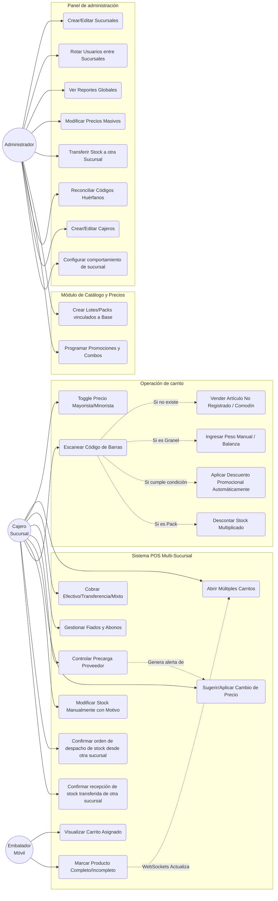

```mermaid
flowchart LR

%% Actores
Admin((Administrador))
Cajero((Cajero<br/>Sucursal))
Embalador((Embalador<br/>Móvil))

%% Panel de administración
subgraph PanelAdmin["Panel de administración"]
    UC1(Crear/Editar Sucursales)
    UC2(Rotar Usuarios entre Sucursales)
    UC3(Ver Reportes Globales)
    UC4(Modificar Precios Masivos)
    UC24(Crear/Editar Cajeros)
    UC19(Reconciliar Códigos Huérfanos)
    UC25(Configurar comportamiento de sucursal)
    UC11(Transferir Stock a otra Sucursal)
end

%% Sistema Central
subgraph SistemaPOS["Sistema POS Multi-Sucursal"]
    UC5(Abrir Múltiples Carritos)
    UC7(Cobrar Efectivo/Transferencia/Mixto)
    UC8(Gestionar Fiados y Abonos)
    UC9(Controlar Precarga Proveedor)
    UC10(Sugerir/Aplicar Cambio de Precio)
    UC12(Modificar Stock Manualmente con Motivo)
    UC13(Visualizar Carrito Asignado)

    UC14(Marcar Producto Completo/Incompleto)
    UC26(Confirmar orden de despacho de stock desde otra sucursal)
    UC27(Confirmar recepción de stock transferida de otra sucursal)
end

subgraph CatalogoPrecios["Módulo de Catálogo y Precios"]
    UC16(Crear Lotes/Packs vinculados a Base)
    UC17(Programar Promociones y Combos)
end

%% Sistema Local (Caja)
subgraph OperacionCarrito["Operación de carrito"]
    UC20(Escanear Código de Barras)
    UC21(Ingresar Peso Manual / Balanza)
    UC22(Aplicar Descuento Promocional Automáticamente)
    UC23(Descontar Stock Multiplicado)
    UC18(Vender Artículo No Registrado / Comodín)
    UC6(Toggle Precio Mayorista/Minorista)
end

%% Relaciones Admin
Admin --> UC1
Admin --> UC2
Admin --> UC3
Admin --> UC4
Admin --> UC11
Admin --> UC16
Admin --> UC17
Admin --> UC19
Admin --> UC24
Admin --> UC25

%% Relaciones Cajero
Cajero --> UC5
Cajero --> UC6
Cajero --> UC7
Cajero --> UC8
Cajero --> UC9
Cajero --> UC10
Cajero --> UC12
Cajero --> UC20
Cajero --> UC26
Cajero --> UC27

%% Relaciones Embalador
Embalador --> UC13
Embalador --> UC14

%% Relaciones compartidas o cruces
UC14 -. "WebSockets Actualiza" .-> UC5
UC9 -. "Genera alerta de" .-> UC10

%% Flujos de escaneo de productos
UC20 -. "Si no existe" .-> UC18
UC20 -. "Si es Granel" .-> UC21
UC20 -. "Si cumple condición" .-> UC22
UC20 -. "Si es Pack" .-> UC23
```
