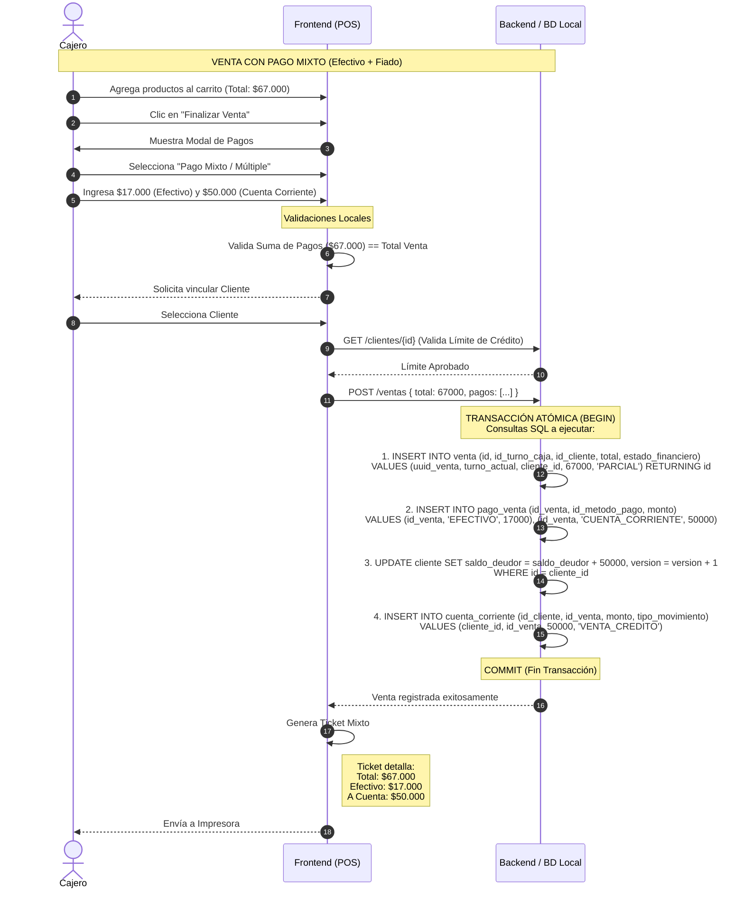

```mermaid
sequenceDiagram

autonumber

actor C as Cajero
participant F as Frontend (POS)
participant B as Backend / BD Local

Note over C,B: VENTA CON PAGO MIXTO (Efectivo + Fiado)

C->>F: Agrega productos al carrito (Total: $67.000)
C->>F: Clic en "Finalizar Venta"
F->>C: Muestra Modal de Pagos
C->>F: Selecciona "Pago Mixto / Múltiple"
C->>F: Ingresa $17.000 (Efectivo) y $50.000 (Cuenta Corriente)

Note over F: Validaciones Locales

F->>F: Valida Suma de Pagos ($67.000) == Total Venta
F-->>C: Solicita vincular Cliente
C->>F: Selecciona Cliente
F->>B: GET /clientes/{id} (Valida Límite de Crédito)
B-->>F: Límite Aprobado

F->>B: POST /ventas { total: 67000, pagos: [...] }

Note over B: TRANSACCIÓN ATÓMICA (BEGIN)<br/>Consultas SQL a ejecutar:

B->>B: 1. INSERT INTO venta (id, id_turno_caja, id_cliente, total, estado_financiero)<br/> VALUES (uuid_venta, turno_actual, cliente_id, 67000, 'PARCIAL') RETURNING id;

B->>B: 2. INSERT INTO pago_venta (id_venta, id_metodo_pago, monto)<br/> VALUES (id_venta, 'EFECTIVO', 17000), (id_venta, 'CUENTA_CORRIENTE', 50000);

B->>B: 3. UPDATE cliente SET saldo_deudor = saldo_deudor + 50000, version = version + 1<br/> WHERE id = cliente_id;

B->>B: 4. INSERT INTO cuenta_corriente (id_cliente, id_venta, monto, tipo_movimiento)<br/> VALUES (cliente_id, id_venta, 50000, 'VENTA_CREDITO');

Note over B: COMMIT (Fin Transacción)

B-->>F: Venta registrada exitosamente
F->>F: Genera Ticket Mixto

Note right of F: Ticket detalla:<br/>Total: $67.000<br/>Efectivo: $17.000<br/>A Cuenta: $50.000

F-->>C: Envía a Impresora
```
