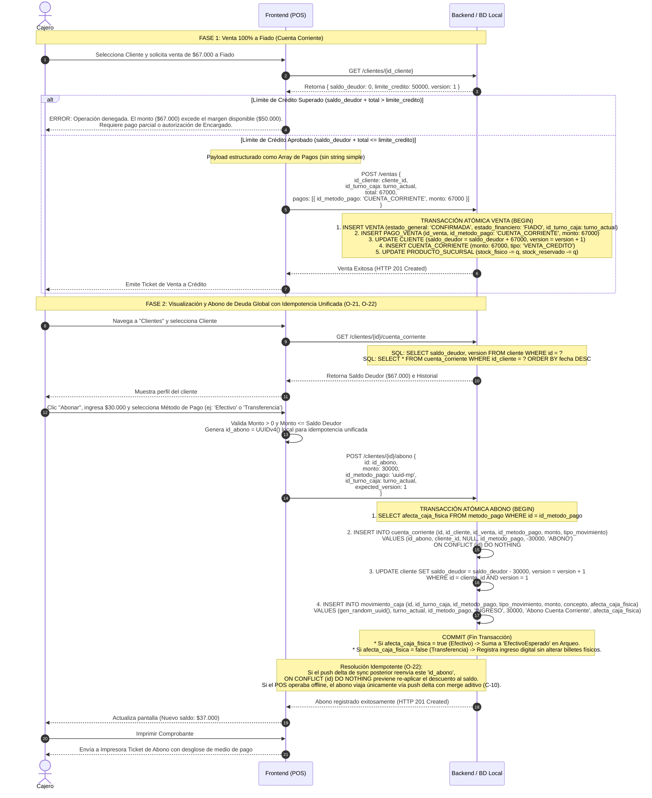

```mermaid
sequenceDiagram

autonumber

actor C as Cajero
participant F as Frontend (POS)
participant B as Backend / BD Local

Note over C,B: FASE 1: Venta 100% a Fiado (Cuenta Corriente)

C->>F: Selecciona Cliente y solicita venta de $67.000 a Fiado

F->>B: GET /clientes/{id_cliente}
B-->>F: Retorna { saldo_deudor: 0, limite_credito: 50000, version: 1 }

alt Límite de Crédito Superado (saldo_deudor + total > limite_credito)
    F-->>C: ERROR: Operación denegada. El monto ($67.000) excede el margen disponible ($50.000).<br/>Requiere pago parcial o autorización de Encargado.
else Límite de Crédito Aprobado (saldo_deudor + total <= limite_credito)
    Note over F: Payload estructurado como Array de Pagos (sin string simple)
    F->>B: POST /ventas {<br/>  id_cliente: cliente_id,<br/>  id_turno_caja: turno_actual,<br/>  total: 67000,<br/>  pagos: [{ id_metodo_pago: 'CUENTA_CORRIENTE', monto: 67000 }]<br/>}

    Note over B: TRANSACCIÓN ATÓMICA VENTA (BEGIN)<br/>1. INSERT VENTA (estado_general: 'CONFIRMADA', estado_financiero: 'FIADO', id_turno_caja: turno_actual)<br/>2. INSERT PAGO_VENTA (id_venta, id_metodo_pago: 'CUENTA_CORRIENTE', monto: 67000)<br/>3. UPDATE CLIENTE (saldo_deudor = saldo_deudor + 67000, version = version + 1)<br/>4. INSERT CUENTA_CORRIENTE (monto: 67000, tipo: 'VENTA_CREDITO')<br/>5. UPDATE PRODUCTO_SUCURSAL (stock_fisico -= q, stock_reservado -= q)

    B-->>F: Venta Exitosa (HTTP 201 Created)
    F-->>C: Emite Ticket de Venta a Crédito
end

Note over C,B: FASE 2: Visualización y Abono de Deuda Global con Idempotencia Unificada (O-21, O-22)

C->>F: Navega a "Clientes" y selecciona Cliente

F->>B: GET /clientes/{id}/cuenta_corriente

Note over B: SQL: SELECT saldo_deudor, version FROM cliente WHERE id = ? <br/>SQL: SELECT * FROM cuenta_corriente WHERE id_cliente = ? ORDER BY fecha DESC;

B-->>F: Retorna Saldo Deudor ($67.000) e Historial

F-->>C: Muestra perfil del cliente

C->>F: Clic "Abonar", ingresa $30.000 y selecciona Método de Pago (ej: 'Efectivo' o 'Transferencia')

F->>F: Valida Monto > 0 y Monto <= Saldo Deudor<br/>Genera id_abono = UUIDv4() local para idempotencia unificada

F->>B: POST /clientes/{id}/abono {<br/>  id: id_abono,<br/>  monto: 30000,<br/>  id_metodo_pago: 'uuid-mp',<br/>  id_turno_caja: turno_actual,<br/>  expected_version: 1<br/>}

Note over B: TRANSACCIÓN ATÓMICA ABONO (BEGIN)<br/>1. SELECT afecta_caja_fisica FROM metodo_pago WHERE id = id_metodo_pago;

B->>B: 2. INSERT INTO cuenta_corriente (id, id_cliente, id_venta, id_metodo_pago, monto, tipo_movimiento)<br/> VALUES (id_abono, cliente_id, NULL, id_metodo_pago, -30000, 'ABONO')<br/> ON CONFLICT (id) DO NOTHING;

B->>B: 3. UPDATE cliente SET saldo_deudor = saldo_deudor - 30000, version = version + 1<br/> WHERE id = cliente_id AND version = 1;

B->>B: 4. INSERT INTO movimiento_caja (id, id_turno_caja, id_metodo_pago, tipo_movimiento, monto, concepto, afecta_caja_fisica)<br/> VALUES (gen_random_uuid(), turno_actual, id_metodo_pago, 'INGRESO', 30000, 'Abono Cuenta Corriente', afecta_caja_fisica);

Note over B: COMMIT (Fin Transacción)<br/>* Si afecta_caja_fisica = true (Efectivo) -> Suma a 'EfectivoEsperado' en Arqueo.<br/>* Si afecta_caja_fisica = false (Transferencia) -> Registra ingreso digital sin alterar billetes físicos.

Note over F,B: Resolución Idempotente (O-22):<br/>Si el push delta de sync posterior reenvía este 'id_abono',<br/>ON CONFLICT (id) DO NOTHING previene re-aplicar el descuento al saldo.<br/>Si el POS operaba offline, el abono viaja únicamente vía push delta con merge aditivo (C-10).

B-->>F: Abono registrado exitosamente (HTTP 201 Created)

F-->>C: Actualiza pantalla (Nuevo saldo: $37.000)

C->>F: Imprimir Comprobante

F-->>C: Envía a Impresora Ticket de Abono con desglose de medio de pago
```
